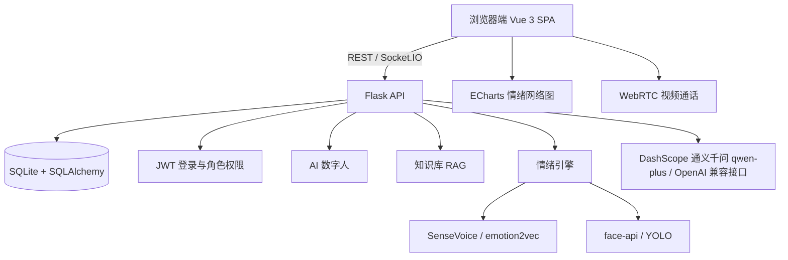

# 聆心 —— 基于大模型智能体的高校辅导员减负与心理预警平台

> 高校心理健康工作长期面临「人少事多」的困境：一名辅导员往往要负责 200 余名学生，谈心谈话记录依赖手工整理（一次约 30 分钟），心理风险主要靠事后发现。传统心理测评系统「只测不管」，通用大模型聊天「只聊不落地」。
>
> 聆心以通义千问大模型为智能中枢，融合多模态情绪识别与知识检索能力，把「谈心记录、视频情绪识别、风险预警、危机工单、AI 数字人、预约咨询」串成一条可追溯的闭环——让辅导员从重复性事务中解放出来，把精力留给真正需要关注的学生。

## 关键指标

- 文本情绪识别：准确率 **73.33%**、宏平均 F1 **77.56%**（30 条内置人工标注评测集，生产关键词基线）
- **80 项**自动化测试全部通过，**61 项**账户与数据完整性校验全部通过，**51 个**演示账号（15 教师端 + 36 学生端）逐一实测
- 演示规模：**12 名辅导员 / 600 名学生**确定性种子数据，全核心流程可跑通
- 已部署上线：**阿里云 ECS**（gunicorn + Nginx + systemd 托管，HTTPS 公网访问），技术栈 Vue3 + Flask + SQLite + ChromaDB

## 创新点

- **多模态情绪融合**：语音（emotion2vec）、人脸表情（FER）、姿态微表情三模态加权投票，输出「情绪—强度—风险」三级评估，抗干扰优于单模态方案
- **状态聚合「取最高不降级」**：多来源风险证据取最高并保留完整证据时间线，避免高危信号被低风险证据稀释；仅人工复核与预警处置两条通道可降级
- **LangGraph 端到端 Agent 编排**：对话陪伴智能体（数字人 + 危机识别）与风险决策智能体（证据聚合 + 预警判定）两条工作流，大模型嵌入真实管理闭环而非停留在对话层

## 核心功能

| 模块 | 能力 |
|---|---|
| AI 谈心助手 | 对话中实时生成共情安抚、开放式提问、积极引导、危机干预等专家级话术供一键选用；结束后一键生成结构化谈心记录并归档学生档案 |
| 情绪网络图 | 以辅导员或全校视角展示学生情绪风险分布，按风险/班级/学院聚类，点击节点直达学生聊天 |
| 视频实时情绪 | 视频通话中融合微表情、语音韵律与后端模型，生成实时情绪和通话总结，并回写学生风险状态 |
| 数字人 | 老师离线时由 AI 分身幽默、亲切地回复学生；支持危机识别、AI 身份标注、TTS 朗读、值班日志流转 |
| 心理预警闭环 | 测评、谈心、视频、数字人、预警处置统一回写学生状态，取最高风险不降级，证据可溯源 |
| 危机工单 | 学工处/管理员可查看、指派、关闭跨角色危机工单，关闭后自动重算学生风险 |
| 知识库 | RAG 混合检索（向量 + BM25 + 新鲜度），文档上传/查看/删除 |
| 预约咨询 | 学生预约、老师确认后自动生成待办，完成后沉淀谈心记录 |
| 通讯与报告 | 师生消息、AI 谈心记录、班会策划、公文写作，Markdown 安全渲染与打印导出 |

## 技术架构



主要目录：

```text
api/routes.py              REST API、危机工单、Socket.IO 事件
core/database.py           SQLAlchemy 模型、状态聚合、风险证据
core/digital_human.py      数字人回复与危机识别
core/emotion_engine.py     语音情绪识别
core/rag_engine.py         知识库检索
static/js/app.js           前端主应用
static/js/network-graph.js 情绪网络图
static/js/realtime/*        实时情绪检测与融合
templates/index.html       Vue 3 单页界面
```

## 快速开始

### Windows 一键启动

双击 `演示一键启动.bat`，脚本会检查 Python/依赖、初始化数据库、必要时生成确定性演示数据，并打印访问地址和测试账号。

也可以使用原有入口 `启动平台.bat`。

### Linux / macOS

```bash
chmod +x run_demo.sh
./run_demo.sh
```

### 手动启动

```bash
python -m venv venv
# Windows
venv\Scripts\activate
# macOS/Linux
source venv/bin/activate

pip install -r requirements.txt
copy .env.example .env   # 按需填写 DASHSCOPE_API_KEY
python app.py
```

访问 `http://127.0.0.1:5000`。

## 测试账号

种子数据为确定性数据，每名辅导员固定 50 名学生。角色和示例账号如下：

| 角色 | 账号 | 密码 |
|---|---|---|
| 超级管理员 | `admin` | `admin123` |
| 学工处 | `liuxin` | `staff123` |
| 学工处 | `student_affairs` | `staff123` |
| 辅导员 | `zhangwei`、`liuqiang`、`wangli`、`zhaolei`、`chenjing`、`yangfan`、`huangwei`、`zhoujie`、`sunpeng`、`wuxiaolin`、`zhengyu`、`tangli` | `counsel123` |
| 学生 | `20240001` 等，具体账号由 `seed_v31.py` 输出 | `123456` |

登录页会通过 `/system/test-accounts` 动态拉取完整账号，不依赖前端硬编码。

## 测试与验证

```bash
python -m pytest tests/ -q
python scripts/verify_test_accounts.py
python scripts/smoke_frontend.py
```

当前测试覆盖：

- 核心闭环：测评 high -> 谈心 medium -> 风险仍为 high -> 预警解决后重算；
- 数字人危机识别、AI 回复落库与预警生成；
- 预警状态机、危机工单指派与关闭；
- 测评边界、预约联动、权限隔离、风险证据时间线；
- 路由与前端页面冒烟。

## 安全与合规

- **定位**：心理育人辅助工具，而非诊疗替代——AI 输出全程标注身份，关键决策保留辅导员人工复核通道；
- **隐私优先**：语音情绪模型支持本地推理，无 API Key 时降级本地规则仍可跑通核心闭环；心理数据按角色授权访问（辅导员仅见本人负责学生）；
- Markdown 统一通过 `DOMPurify.sanitize(marked.parse(...))` 后再渲染，防 XSS；
- 密码使用 Werkzeug 哈希存储，登录与敏感操作写审计日志；
- `.env`、`data/*.db`、模型文件已加入 `.gitignore`；
- 关键 API 请求失败会触发前端 Toast，不再静默吞错。

## 更新记录

- `v3.2.1`：修复会话整理引擎未初始化（批量整理/上传文档 AI 整理失效）、视频通话拒绝无回执、语音情绪无 API key 时 500（改为声学保守判定兜底）、教师端未读徽标与知识库文档数占位；新增 `scripts/test_all_accounts.py` 全账号实测脚本；演示数据治理（清理测试残留与灌水、补录测评/预约/档案/危机工单/多源风险证据链）；
- `v3.2`：AI 数字人、危机工单、风险证据时间线、预约闭环、XSS 防护、测试补齐；
- `v3.1`：情绪网络图、实时情绪融合、在线状态；
- `v3.0`：深色模式、现代化 UI、响应式布局。
